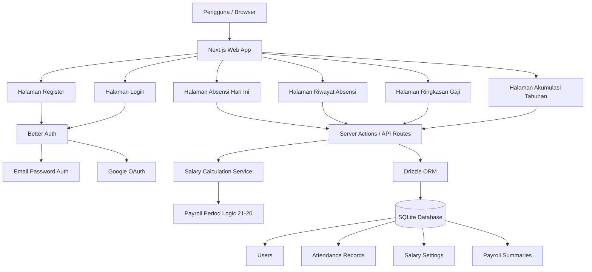
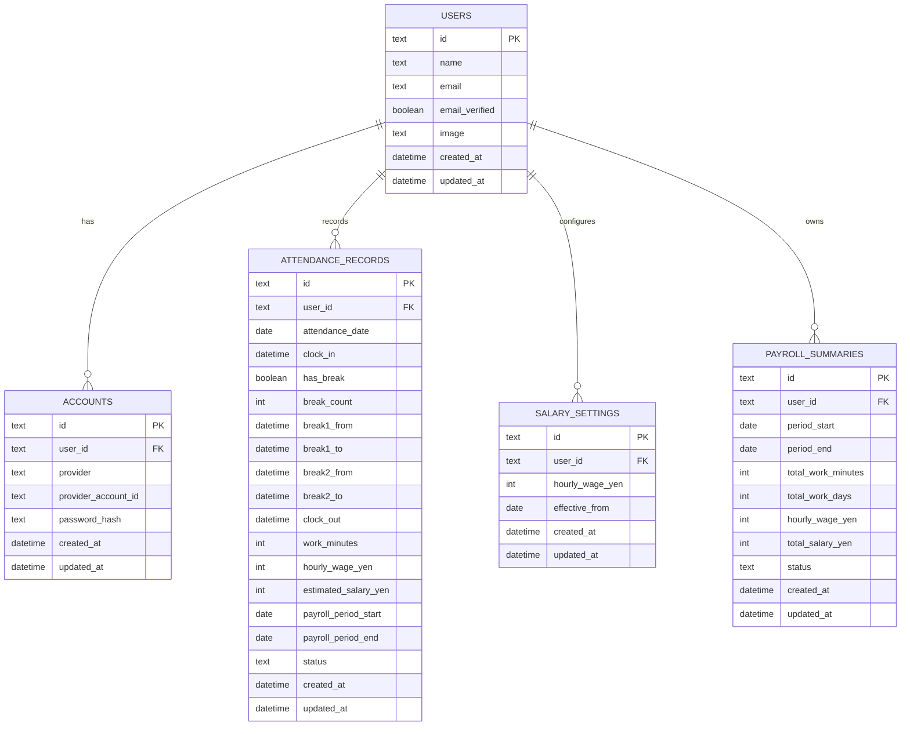

# PRD — Project Requirements Document

## 1. **Overview**

Aplikasi web absensi kerja ini dibuat untuk menggantikan proses absensi manual di kertas. Kondisi saat ini memiliki 6 kolom waktu: **in**, **rest time from 1**, **rest time to 1**, **rest time from 2**, **rest time to 2**, dan **out**.

Tujuan utama aplikasi adalah memudahkan pengguna mencatat jam masuk, jam istirahat, dan jam pulang secara digital, sekaligus menampilkan **perhitungan gaji secara real time** berdasarkan total jam kerja. Aplikasi harus fleksibel karena tidak semua hari kerja memiliki istirahat, dan jika ada istirahat, jumlahnya bisa **1 kali** atau **2 kali**.

Aplikasi juga mengikuti aturan tutup buku gaji: periode perhitungan dimulai dari **tanggal 21** sampai **tanggal 20 bulan berikutnya**. Pengguna dapat melihat total jam kerja dan total gaji untuk periode berjalan, periode sebelumnya, serta akumulasi dalam setahun.

Aplikasi ditujukan untuk penggunaan pribadi atau internal sederhana, tanpa halaman admin, mudah dipakai, dan cocok dibangun oleh pemula dengan tech stack yang tidak terlalu kompleks.

## 2. **Requirements**

- Pengguna harus bisa membuat akun melalui halaman register.
- Pengguna bisa register/login menggunakan:
  - Email dan password.
  - Google OAuth.
- Pengguna harus login sebelum melakukan absensi.
- Aplikasi tidak membutuhkan halaman admin.
- Sistem harus menyimpan data absensi berdasarkan pengguna dan tanggal.
- Setiap pengguna hanya dapat membuat satu data absensi per hari.
- Pengguna dapat memilih apakah hari tersebut memiliki istirahat atau tidak.
- Jika ada istirahat, pengguna dapat memilih jumlah istirahat: 1 kali atau 2 kali.
- Sistem harus mendukung 6 kolom waktu utama:
  - Jam masuk / in
  - Istirahat 1 mulai / rest time from 1
  - Istirahat 1 selesai / rest time to 1
  - Istirahat 2 mulai / rest time from 2
  - Istirahat 2 selesai / rest time to 2
  - Jam pulang / out
- Kolom waktu istirahat bersifat opsional sesuai pilihan pengguna.
- Sistem harus menghitung total jam kerja harian secara otomatis.
- Total jam kerja dihitung dari selisih jam masuk dan jam pulang, dikurangi durasi istirahat.
- Sistem harus menampilkan estimasi gaji real time berdasarkan jam kerja.
- Gaji per jam default adalah **1.115 yen**.
- Sistem harus mendukung aturan periode gaji:
  - Periode dimulai tanggal **21**.
  - Periode berakhir tanggal **20 bulan berikutnya**.
  - Contoh: periode gaji April dihitung dari 21 Maret sampai 20 April.
- Pengguna dapat memilih periode gaji sebelumnya menggunakan selector.
- Sistem harus menampilkan total jam kerja dan total gaji untuk periode yang dipilih.
- Sistem harus menampilkan akumulasi gaji dalam setahun.
- Pengguna dapat melihat riwayat absensi pribadi.
- Aplikasi harus mudah dikembangkan, mudah dijalankan secara lokal, dan tidak membutuhkan konfigurasi server yang rumit di tahap awal.

## 3. **Core Features**

- **Register pengguna**
  - Pengguna dapat membuat akun baru dengan email dan password.
  - Pengguna dapat register/login menggunakan akun Google.
  - Setelah register berhasil, pengguna diarahkan ke halaman absensi hari ini.

- **Login pengguna**
  - Pengguna masuk menggunakan email dan password atau Google.
  - Setelah login, pengguna diarahkan ke halaman absensi hari ini.

- **Form absensi harian**
  - Tombol atau input untuk mencatat jam masuk.
  - Pilihan: ada istirahat atau tidak.
  - Jika memilih ada istirahat, pengguna memilih jumlah istirahat: 1 atau 2 kali.
  - Input waktu untuk istirahat pertama dan kedua sesuai pilihan.
  - Tombol atau input untuk mencatat jam pulang.

- **Validasi sederhana**
  - Jam masuk harus diisi sebelum jam pulang.
  - Jika memilih istirahat 1 kali, hanya field istirahat pertama yang wajib/aktif.
  - Jika memilih istirahat 2 kali, field istirahat pertama dan kedua aktif.
  - Jam pulang tidak boleh lebih awal dari jam masuk.
  - Waktu istirahat harus berada di antara jam masuk dan jam pulang.
  - Waktu selesai istirahat tidak boleh lebih awal dari waktu mulai istirahat.

- **Perhitungan jam kerja real time**
  - Sistem menghitung total durasi kerja harian secara otomatis.
  - Rumus dasar:
    - Total jam kerja = jam pulang - jam masuk - total durasi istirahat.
  - Jika jam pulang belum diisi, sistem dapat menampilkan estimasi sementara berdasarkan waktu saat ini.

- **Perhitungan gaji real time**
  - Sistem menampilkan estimasi gaji harian berdasarkan total jam kerja.
  - Sistem menampilkan total gaji dalam periode berjalan.
  - Rumus dasar:
    - Total gaji = total jam kerja × 1.115 yen.
  - Contoh:
    - Total kerja 8 jam.
    - Gaji per jam 1.115 yen.
    - Estimasi gaji = 8 × 1.115 = 8.920 yen.

- **Periode gaji tanggal 21–20**
  - Sistem otomatis menentukan periode gaji aktif berdasarkan tanggal hari ini.
  - Jika hari ini tanggal 21 sampai akhir bulan, periode berjalan dimulai tanggal 21 bulan ini dan berakhir tanggal 20 bulan berikutnya.
  - Jika hari ini tanggal 1 sampai 20, periode berjalan dimulai tanggal 21 bulan sebelumnya dan berakhir tanggal 20 bulan ini.

- **Selector periode gaji sebelumnya**
  - Pengguna dapat memilih periode gaji sebelumnya dari dropdown/select.
  - Contoh pilihan:
    - 21 Januari – 20 Februari
    - 21 Februari – 20 Maret
    - 21 Maret – 20 April
  - Setelah memilih periode, sistem menampilkan total jam kerja dan total gaji pada periode tersebut.

- **Akumulasi gaji setahun**
  - Sistem menampilkan total jam kerja dan total gaji selama satu tahun.
  - Pengguna dapat memilih tahun yang ingin dilihat.
  - Data ditampilkan dalam ringkasan bulanan/periode agar mudah dibandingkan.

- **Riwayat absensi pribadi**
  - Pengguna dapat melihat data absensi sebelumnya.
  - Data ditampilkan dalam format tanggal, jam masuk, istirahat, jam pulang, total jam kerja, dan estimasi gaji harian.

- **Pengaturan sederhana**
  - Pengguna dapat melihat atau mengubah gaji per jam jika nanti diperlukan.
  - Default awal tetap **1.115 yen per jam**.

## 4. **User Flow**

1. Pengguna membuka aplikasi web.
2. Jika belum punya akun, pengguna membuka halaman register.
3. Pengguna memilih register dengan email/password atau Google.
4. Setelah register atau login berhasil, pengguna masuk ke halaman absensi hari ini.
5. Pengguna menekan tombol atau mengisi waktu **in** saat mulai bekerja.
6. Sistem menanyakan apakah hari ini ada istirahat.
7. Jika tidak ada istirahat:
   - Field istirahat disembunyikan atau dinonaktifkan.
   - Pengguna langsung mengisi waktu **out** saat selesai bekerja.
8. Jika ada istirahat:
   - Pengguna memilih jumlah istirahat: 1 kali atau 2 kali.
   - Untuk 1 kali istirahat, pengguna mengisi **rest time from 1** dan **rest time to 1**.
   - Untuk 2 kali istirahat, pengguna mengisi **rest time from 1**, **rest time to 1**, **rest time from 2**, dan **rest time to 2**.
9. Saat data waktu diisi, sistem menghitung total jam kerja secara otomatis.
10. Sistem menampilkan estimasi gaji harian secara real time.
11. Sistem juga menampilkan total jam kerja dan total gaji untuk periode berjalan, yaitu tanggal 21 sampai tanggal 20 bulan berikutnya.
12. Pengguna dapat membuka halaman riwayat untuk melihat absensi sebelumnya.
13. Pengguna dapat memakai selector periode untuk melihat total gaji bulan/periode sebelumnya.
14. Pengguna dapat membuka halaman ringkasan tahunan untuk melihat akumulasi gaji dalam setahun.
15. Pengguna dapat logout setelah selesai menggunakan aplikasi.

## 5. **Architecture**

Aplikasi menggunakan arsitektur full-stack sederhana. Frontend dan backend berada dalam satu project agar lebih mudah dipelajari oleh pemula. Pengguna mengakses aplikasi melalui browser, lalu aplikasi berkomunikasi dengan server untuk register, login, menyimpan absensi, menghitung gaji, mengambil riwayat, dan menampilkan ringkasan gaji.

Komponen utama:

- **Browser pengguna**: tempat pengguna register, login, mengisi absensi, dan melihat ringkasan gaji.
- **Next.js Web App**: menangani tampilan halaman sekaligus logic server sederhana.
- **Better Auth**: menangani register, login, logout, session, email/password, dan Google OAuth.
- **Server Actions / API Routes**: menangani proses simpan data, ambil data, dan menjalankan perhitungan.
- **Salary Calculation Service**: logic untuk menghitung total jam kerja dan estimasi gaji.
- **Payroll Period Logic 21-20**: logic khusus untuk menentukan periode gaji dari tanggal 21 sampai tanggal 20 bulan berikutnya.
- **Drizzle ORM**: membantu aplikasi membaca dan menulis data ke database dengan lebih rapi.
- **SQLite Database**: database lokal/file-based yang mudah dipakai untuk tahap awal.

## 6. **Database Schema**

Database dibuat sederhana agar mudah dipahami dan dikembangkan. Struktur utama terdiri dari tabel pengguna, tabel auth account, tabel absensi, pengaturan gaji, dan ringkasan payroll.

### Tabel: `users`

| Kolom | Tipe | Kegunaan |
|---|---|---|
| `id` | text / uuid | ID unik pengguna |
| `name` | text nullable | Nama pengguna |
| `email` | text | Email untuk login |
| `email_verified` | boolean | Status apakah email sudah terverifikasi |
| `image` | text nullable | Foto profil dari Google jika ada |
| `created_at` | datetime | Waktu akun dibuat |
| `updated_at` | datetime | Waktu akun terakhir diperbarui |

### Tabel: `accounts`

| Kolom | Tipe | Kegunaan |
|---|---|---|
| `id` | text / uuid | ID unik account auth |
| `user_id` | text / uuid | Relasi ke pengguna |
| `provider` | text | Provider login, misalnya `credential` atau `google` |
| `provider_account_id` | text nullable | ID akun dari provider OAuth |
| `password_hash` | text nullable | Password yang sudah dienkripsi/hash untuk email/password |
| `created_at` | datetime | Waktu data dibuat |
| `updated_at` | datetime | Waktu data terakhir diperbarui |

### Tabel: `attendance_records`

| Kolom | Tipe | Kegunaan |
|---|---|---|
| `id` | text / uuid | ID unik data absensi |
| `user_id` | text / uuid | Relasi ke pengguna yang melakukan absensi |
| `attendance_date` | date | Tanggal absensi |
| `clock_in` | datetime nullable | Waktu masuk kerja / in |
| `has_break` | boolean | Menandakan apakah hari tersebut ada istirahat |
| `break_count` | integer | Jumlah istirahat: 0, 1, atau 2 |
| `break1_from` | datetime nullable | Waktu mulai istirahat pertama |
| `break1_to` | datetime nullable | Waktu selesai istirahat pertama |
| `break2_from` | datetime nullable | Waktu mulai istirahat kedua |
| `break2_to` | datetime nullable | Waktu selesai istirahat kedua |
| `clock_out` | datetime nullable | Waktu pulang kerja / out |
| `work_minutes` | integer | Total menit kerja setelah dikurangi istirahat |
| `hourly_wage_yen` | integer | Gaji per jam yang dipakai untuk record ini, default 1115 |
| `estimated_salary_yen` | integer | Estimasi gaji harian berdasarkan total jam kerja |
| `payroll_period_start` | date | Tanggal mulai periode gaji, selalu tanggal 21 |
| `payroll_period_end` | date | Tanggal akhir periode gaji, selalu tanggal 20 bulan berikutnya |
| `status` | text | Status absensi, misalnya `draft`, `completed`, atau `edited` |
| `created_at` | datetime | Waktu data dibuat |
| `updated_at` | datetime | Waktu data terakhir diperbarui |

### Tabel: `salary_settings`

| Kolom | Tipe | Kegunaan |
|---|---|---|
| `id` | text / uuid | ID unik pengaturan gaji |
| `user_id` | text / uuid | Relasi ke pengguna |
| `hourly_wage_yen` | integer | Gaji per jam dalam yen, default 1115 |
| `effective_from` | date | Tanggal mulai berlakunya gaji per jam |
| `created_at` | datetime | Waktu data dibuat |
| `updated_at` | datetime | Waktu data terakhir diperbarui |

### Tabel: `payroll_summaries`

| Kolom | Tipe | Kegunaan |
|---|---|---|
| `id` | text / uuid | ID unik ringkasan payroll |
| `user_id` | text / uuid | Relasi ke pengguna |
| `period_start` | date | Tanggal mulai periode, misalnya 21 Maret |
| `period_end` | date | Tanggal akhir periode, misalnya 20 April |
| `total_work_minutes` | integer | Total menit kerja dalam periode |
| `total_work_days` | integer | Total hari kerja dalam periode |
| `hourly_wage_yen` | integer | Gaji per jam yang digunakan |
| `total_salary_yen` | integer | Total estimasi gaji periode tersebut |
| `status` | text | Status ringkasan, misalnya `open` atau `closed` |
| `created_at` | datetime | Waktu data dibuat |
| `updated_at` | datetime | Waktu data terakhir diperbarui |

### Diagram ER

Catatan penting:

- Kombinasi `user_id` dan `attendance_date` sebaiknya dibuat unik agar satu pengguna hanya memiliki satu absensi per hari.
- Field istirahat boleh kosong jika pengguna memilih tidak ada istirahat.
- Jika `break_count = 1`, maka hanya `break1_from` dan `break1_to` yang digunakan.
- Jika `break_count = 2`, maka semua field istirahat digunakan.
- `work_minutes` dapat dihitung ulang dari data waktu agar hasil tetap akurat.
- `hourly_wage_yen` disimpan di `attendance_records` agar histori gaji lama tidak berubah jika gaji per jam di masa depan diubah.
- `payroll_period_start` dan `payroll_period_end` membantu query data berdasarkan periode 21–20 menjadi lebih mudah.
- `payroll_summaries` bisa dibuat otomatis atau dihitung langsung saat pengguna membuka halaman ringkasan gaji.

## 7. **Tech Stack**

Rekomendasi tech stack yang mudah diterapkan untuk pemula:

- **Next.js**
  - Framework utama untuk membuat aplikasi web full-stack.
  - Cocok karena frontend dan backend bisa dibuat dalam satu project.

- **Tailwind CSS**
  - Untuk styling tampilan dengan cepat.
  - Cocok untuk membuat form, tabel, card ringkasan gaji, dan halaman riwayat.

- **shadcn/ui**
  - Kumpulan komponen UI siap pakai seperti button, input, select, dialog, card, dan table.
  - Membantu pemula membuat tampilan yang rapi tanpa membuat semua komponen dari nol.

- **Drizzle ORM**
  - Untuk mengelola query database dengan struktur yang lebih aman dan rapi.
  - Cocok untuk project kecil sampai menengah.

- **SQLite**
  - Database sederhana berbasis file.
  - Mudah dipakai untuk belajar dan tahap awal karena tidak perlu setup server database terpisah.

- **Better Auth**
  - Untuk fitur register, login, logout, session, email/password, dan Google OAuth.
  - Membantu mengurangi pekerjaan membuat sistem autentikasi dari nol.

- **Vercel atau VPS sederhana untuk deployment**
  - Untuk tahap belajar, aplikasi dapat dijalankan lokal terlebih dahulu.
  - Jika sudah siap online, bisa dipertimbangkan deploy ke Vercel atau server sederhana.

Rekomendasi awal untuk pemula:

1. Buat halaman register dan login dengan email/password terlebih dahulu.
2. Tambahkan login/register dengan Google setelah alur dasar stabil.
3. Buat halaman absensi hari ini.
4. Simpan data absensi ke SQLite.
5. Buat logic perhitungan total jam kerja harian.
6. Tambahkan perhitungan gaji real time dengan default 1.115 yen per jam.
7. Buat logic periode gaji tanggal 21 sampai tanggal 20 bulan berikutnya.
8. Buat selector untuk melihat periode sebelumnya.
9. Buat halaman akumulasi gaji tahunan.